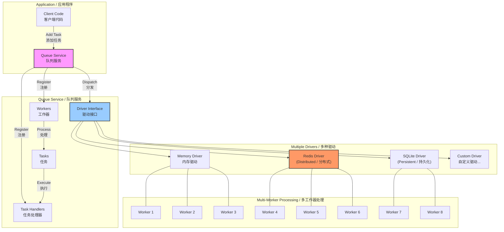

# Go-Queue

[](https://goreportcard.com/report/github.com/duxweb/go-queue)
[](https://godoc.org/github.com/duxweb/go-queue)
[](https://opensource.org/licenses/MIT)

A high-performance, extensible queue library for Go, supporting multiple queue drivers, task retry mechanisms, and delayed execution.
一个高性能、可扩展的Go语言队列库，支持多种队列驱动、任务重试机制和延迟执行。

## Framework Architecture / 框架架构



### Design Highlights / 设计要点

- **Queue Service Core**: Central manager that coordinates drivers, workers, and handlers.
- **队列服务核心**: 中央管理器，协调驱动、工作器和处理器。

- **Driver Interface**: Common abstraction for different storage backends.
- **驱动接口**: 为不同存储后端提供统一抽象。

- **Worker Isolation**: Each queue can have multiple isolated workers with independent configuration.
- **工作器隔离**: 每个队列可以有多个独立配置的隔离工作器。

- **Parallel Processing**: Multiple workers can process tasks concurrently.
- **并行处理**: 多个工作器可以并发处理任务。

- **Driver Flexibility**: Switch between memory, persistent, or distributed queues without changing application code.
- **驱动灵活性**: 在不改变应用代码的情况下切换内存、持久化或分布式队列。

## Features / 特性

- **Multiple Queue Drivers**: Built-in memory queue driver, extensible to add other drivers
- **多种队列驱动**: 内置内存队列驱动，可扩展添加其他驱动

- **Driver Extensibility**: Easily implement your own queue driver by implementing the QueueDriver interface
- **驱动可扩展性**: 通过实现 QueueDriver 接口，轻松创建自定义队列驱动

- **Concurrency Control**: Configure the number of workers for each queue
- **并发控制**: 为每个队列配置工作线程数量

- **Automatic Retry**: Configurable retry count and retry delay
- **自动重试**: 可配置重试次数和重试延迟

- **Delayed Execution**: Schedule tasks to run at a specific time
- **延迟执行**: 可以安排任务在指定时间执行

- **Timeout Control**: Set maximum execution time for tasks
- **超时控制**: 为任务设置最大执行时间

- **Statistics**: Track processed tasks, success rates, and processing times
- **统计数据**: 跟踪已处理任务、成功率和处理时间

- **Callbacks**: Custom callbacks for task success and failure events
- **回调函数**: 任务成功和失败事件的自定义回调

- **Graceful Shutdown**: Close queues safely without losing tasks
- **优雅关闭**: 安全关闭队列，不丢失任务

## Installation / 安装

```bash
go get -u github.com/duxweb/go-queue
```

## Drivers / 驱动

- Memory: 内存队列 (Memory Queue)
- SQLite: 基于SQLite的持久化队列，纯Go实现无CGO依赖 (SQLite-based persistent queue, pure Go implementation without CGO dependency)
- Redis: 基于Redis的分布式队列 (Redis-based distributed queue)
- Custom: 自定义队列驱动，实现 QueueDriver 接口即可 (Custom queue driver, just implement the QueueDriver interface)

### Memory Queue / 内存队列

```go
import (
    "github.com/duxweb/go-queue"
    "github.com/duxweb/go-queue/drivers/memory"
)

// Create memory queue instance
memQueue := memory.New()
queueService := queue.New(memQueue)
```

### SQLite Queue / SQLite队列

SQLite队列是基于modernc.org/sqlite实现的持久化队列，是纯Go实现，不需要CGO支持，可以很方便地进行交叉编译。

```go
import (
    "github.com/duxweb/go-queue"
    "github.com/duxweb/go-queue/drivers/sqlite"
)

// Create SQLite queue instance
options := &sqlite.SQLiteOptions{
    DBPath: "queue.db", // 数据库文件路径
}
sqliteQueue, err := sqlite.New(options)
queueService := queue.New(sqliteQueue)
```

### Redis Queue / Redis队列

Redis队列是基于Redis实现的分布式队列，适合多实例部署的场景。

```go
import (
    "github.com/duxweb/go-queue"
    "github.com/duxweb/go-queue/drivers/redis"
    goredis "github.com/redis/go-redis/v9"
)

// 方法1: 使用配置创建 Redis 队列实例
options := &redis.Options{
    Addr:     "localhost:6379", // Redis 服务器地址
    Password: "",               // Redis 密码
    DB:       0,                // 使用的数据库
    Timeout:  time.Second * 5,  // 操作超时
}
redisQueue, err := redis.New(options)
queueService := queue.New(redisQueue)

// 方法2: 使用现有的 Redis 客户端
client := goredis.NewClient(&goredis.Options{
    Addr:     "localhost:6379",
    Password: "",
    DB:       0,
})
options := redis.WithClient(client)
redisQueue, err := redis.New(options)
queueService := queue.New(redisQueue)
```

### Custom Queue Driver / 自定义队列驱动

您可以通过实现 QueueDriver 接口来创建自己的队列驱动。以下是自定义队列驱动的基本实现示例：

```go
import (
    "github.com/duxweb/go-queue"
)

// 自定义队列驱动
type MyCustomQueue struct {
    // 自定义字段
}

// 创建新的自定义队列
func NewCustomQueue() *MyCustomQueue {
    return &MyCustomQueue{
        // 初始化自定义字段
    }
}

// 实现 QueueDriver 接口方法

// Pop 从队列中弹出数据
func (q *MyCustomQueue) Pop(workerName string, num int) []*queue.QueueItem {
    // 实现从自定义存储中获取队列数据的逻辑
    return items
}

// Add 添加数据到队列
func (q *MyCustomQueue) Add(workerName string, item *queue.QueueItem) error {
    // 实现添加队列数据到自定义存储的逻辑
    return nil
}

// Del 从队列中删除数据
func (q *MyCustomQueue) Del(workerName string, id string) error {
    // 实现从自定义存储中删除队列数据的逻辑
    return nil
}

// Count 获取队列数据数量
func (q *MyCustomQueue) Count(workerName string) int {
    // 实现获取自定义存储中队列数据数量的逻辑
    return count
}

// List 获取队列列表
func (q *MyCustomQueue) List(workerName string, page int, limit int) []*queue.QueueItem {
    // 实现获取自定义存储中队列数据列表的逻辑
    return items
}

// Close 关闭队列
func (q *MyCustomQueue) Close() error {
    // 实现关闭自定义队列的逻辑
    return nil
}

// 注册并使用自定义队列驱动
func main() {
    // 创建自定义队列驱动
    customQueue := NewCustomQueue()

    // 创建队列服务并注册自定义驱动
    queueService := queue.New(customQueue)

    // 使用队列服务...
}
```

## Quick Start / 快速开始

```go
package main

import (
    "context"
    "fmt"
    "time"

    goqueue "github.com/duxweb/go-queue"
    "github.com/duxweb/go-queue/drivers"
)

func main() {
    // Create context
    // 创建上下文
    ctx := context.Background()

    // Create queue service config
    // 创建队列服务配置
    config := &goqueue.Config{
        Context: ctx,
    }

    // Create new queue service
    // 创建新的队列服务
    queueService, _ := goqueue.New(config)

    // Create memory queue instance
    // 创建内存队列实例
    memQueue := drivers.NewMemoryQueue()

    // Register queue driver
    // 注册队列驱动
    queueService.RegisterDriver("default", memQueue)

    // Configure worker
    // 配置工作器
    workerConfig := &goqueue.WorkerConfig{
        DeviceName: "default",
        Num:         5,                // Concurrent workers / 并发工作数量
        Interval:    time.Second * 1,  // Polling interval / 轮询间隔
        Retry:       3,                // Retry attempts / 重试次数
        RetryDelay:  time.Second * 5,  // Delay between retries / 重试间隔
        Timeout:     time.Minute,      // Task timeout / 任务超时时间
    }

    // Register worker
    // 注册工作器
    queueService.RegisterWorker("default", workerConfig)

    // Register task handler
    // 注册任务处理器
    queueService.RegisterHandler("example-handler", func(ctx context.Context, params []byte) error {
        fmt.Printf("Processing task: %s\n", string(params))
        return nil
    })

    // Add a task
    // 添加任务
    id, _ := queueService.Add("default", &goqueue.QueueConfig{
        HandlerName: "example-handler",
        Params:      []byte(`{"message":"This is a test task"}`),
    })

    fmt.Printf("Task added successfully: %s\n", id)
    // fmt.Printf("添加任务成功: %s\n", id)

    // Start queue processing
    // 启动队列处理
    queueService.Start()

    // Wait for tasks to complete
    // 等待任务完成
    time.Sleep(time.Second * 10)

    // Stop queue service
    // 停止队列服务
    queueService.Stop()
}
```

## Advanced Usage / 高级用法

### Delayed Tasks / 延迟任务

```go
// Add a delayed task (runs after 5 seconds)
// 添加延迟任务（5秒后执行）
id, _ := queueService.AddDelay("default", &goqueue.QueueDelayConfig{
    QueueConfig: goqueue.QueueConfig{
        HandlerName: "example-handler",
        Params:      []byte(`{"message":"This is a delayed task"}`),
    },
    Delay: time.Second * 5,
})
```

### Task Retry / 任务重试

Configure retry behavior:
配置重试行为：

```go
workerConfig := &goqueue.WorkerConfig{
    DeviceName: "default",
    Retry:       3,                // Maximum retry attempts / 最大重试次数
    RetryDelay:  time.Second * 2,  // Delay between retries / 重试间隔
}
```

### Success and Failure Callbacks / 成功和失败回调

```go
workerConfig := &goqueue.WorkerConfig{
    // ... other configs / 其他配置
    SuccessFunc: func(item *goqueue.QueueItem) {
        fmt.Printf("Task executed successfully: %s\n", item.ID)
        // fmt.Printf("任务执行成功: %s\n", item.ID)
    },
    FailFunc: func(item *goqueue.QueueItem, err error) {
        fmt.Printf("Task failed: %s, error: %v\n", item.ID, err)
        // fmt.Printf("任务执行失败: %s, 错误: %v\n", item.ID, err)
    },
}
```

## Benchmark Results / 性能基准测试结果

Performance benchmark results for memory queue and SQLite queue drivers (tested on Apple M4):
内存队列和 SQLite 队列驱动的性能基准测试结果（在 Apple M4 上测试）：

### Memory Queue Performance / 内存队列性能

| Operation / 操作 | Iterations / 迭代次数 | Time per Operation / 每次操作时间 | Memory per Operation / 每次操作内存使用 | Allocations per Operation / 每次操作内存分配次数 |
|-----------|------------|-------------------|---------------------|--------------------------|
| Add / 添加 | 2,958,324  | 367.4 ns/op       | 316 B/op            | 4 allocs/op             |
| Pop / 弹出 | 48,910     | 24,391 ns/op      | 65,828 B/op         | 33 allocs/op            |
| Delete / 删除 | 6,601,080  | 214.6 ns/op       | 0 B/op              | 0 allocs/op             |
| List / 列表 | 224,417,496| 5.308 ns/op       | 0 B/op              | 0 allocs/op             |
| Count / 计数 | 262,194,860| 4.578 ns/op      | 0 B/op              | 0 allocs/op             |

### SQLite Queue Performance / SQLite 队列性能

| Operation / 操作 | Iterations / 迭代次数 | Time per Operation / 每次操作时间 | Memory per Operation / 每次操作内存使用 | Allocations per Operation / 每次操作内存分配次数 |
|-----------|------------|-------------------|---------------------|--------------------------|
| Add / 添加 | 4,821      | 228,815 ns/op     | 1,610 B/op          | 33 allocs/op            |
| Pop / 弹出 | 5,455      | 245,389 ns/op     | 4,044 B/op          | 111 allocs/op           |
| Delete / 删除 | 5,553      | 197,711 ns/op     | 1,008 B/op          | 22 allocs/op            |
| List / 列表 | 32,601     | 36,336 ns/op      | 17,016 B/op         | 548 allocs/op           |
| Count / 计数 | 26,211     | 42,684 ns/op      | 728 B/op            | 21 allocs/op            |

### Redis Queue Performance / Redis 队列性能

| Operation / 操作 | Iterations / 迭代次数 | Time per Operation / 每次操作时间 | Memory per Operation / 每次操作内存使用 | Allocations per Operation / 每次操作内存分配次数 |
|-----------|------------|-------------------|---------------------|--------------------------|
| Add / 添加 | 17,394     | 71,413 ns/op      | 1,910 B/op          | 39 allocs/op            |
| Pop / 弹出 | 6,097      | 194,806 ns/op     | 2,832 B/op          | 65 allocs/op            |
| Delete / 删除 | 18,559    | 66,018 ns/op      | 1,217 B/op          | 29 allocs/op            |
| List / 列表 | 5,454      | 218,728 ns/op     | 44,873 B/op         | 1,182 allocs/op         |
| Count / 计数 | 19,345    | 61,238 ns/op      | 604 B/op            | 13 allocs/op            |
| Batch Add / 批量添加 | 17,810 | 71,362 ns/op      | 1,952 B/op          | 39 allocs/op            |

### Performance Comparison / 性能对比

| Operation / 操作 | Memory Queue / 内存队列 | SQLite Queue / SQLite队列 | Redis Queue / Redis队列 | Memory:SQLite:Redis Ratio / 速度比例 |
|-----------|-------------|------------|------------|--------------------------------|
| Add / 添加 | 345.9 ns/op  | 228,815 ns/op | 71,413 ns/op | 1 : 661 : 207              |
| Pop / 弹出 | 29,372 ns/op | 245,389 ns/op | 194,806 ns/op | 1 : 8.4 : 6.6              |
| Delete / 删除 | 190.6 ns/op  | 197,711 ns/op | 66,018 ns/op | 1 : 1,037 : 346            |
| List / 列表 | 5.338 ns/op  | 36,336 ns/op  | 218,728 ns/op | 1 : 6,807 : 40,976          |
| Count / 计数 | 4.438 ns/op  | 42,684 ns/op  | 61,238 ns/op | 1 : 9,618 : 13,799          |

These benchmarks show that:
这些基准测试结果表明：

- Memory queue is significantly faster than both SQLite and Redis queues for all operations
- 内存队列在所有操作上都明显快于SQLite和Redis队列

- Memory queue operations are mostly sub-microsecond, while SQLite and Redis operations are in the microsecond range
- 内存队列操作大多是亚微秒级的，而SQLite和Redis操作则是微秒级的

- Redis queue generally outperforms SQLite for Add and Delete operations, but is slower for List operations
- Redis队列在添加和删除操作上通常比SQLite队列性能更好，但在列表操作上较慢

- For high-performance needs with no persistence requirement, Memory queue is the best choice
- 对于没有持久化需求的高性能场景，内存队列是最佳选择

- For persistence needs with single process, SQLite queue offers a good balance of performance and reliability
- 对于单进程下需要持久化的场景，SQLite队列提供了性能和可靠性的良好平衡

- If you need a pure Go implementation without CGO, SQLite queue (using modernc.org/sqlite) is a great option
- 如果需要不依赖CGO的纯Go实现，SQLite队列（使用modernc.org/sqlite）是一个很好的选择

- For distributed systems requiring shared queue access, Redis queue is recommended despite being slower for some operations
- 对于需要共享队列访问的分布式系统，尽管Redis队列在某些操作上较慢，但仍推荐使用

Run your own benchmarks with:
运行自己的基准测试：

```bash
cd benchmark
go test -bench=. -benchmem
```

## Example Projects / 示例项目

Check the `example` directory for complete, runnable examples:
查看 `example` 目录以获取完整的、可运行的示例：

- `basic/` - Basic queue operations / 基本队列操作
- `drivers/` - Driver queue operations / 驱动队列操作
- `retry/` - Task retry mechanism / 任务重试机制
- `multi_queues/` - Multiple parallel queues / 多个并行队列

## License / 许可证

MIT License
MIT 许可证
